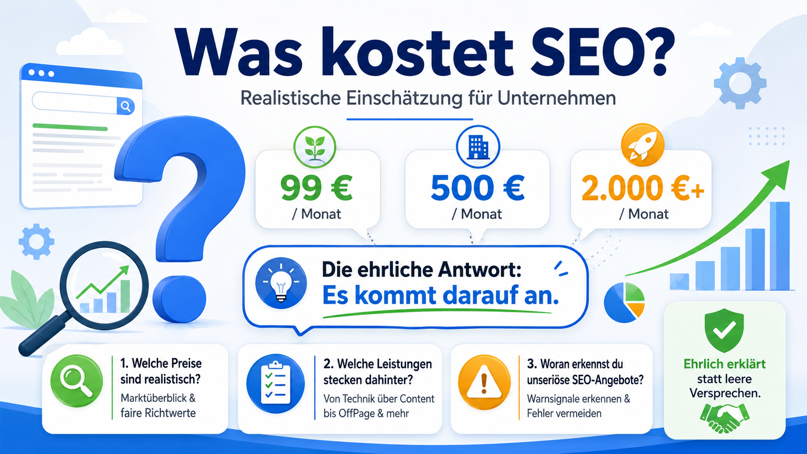
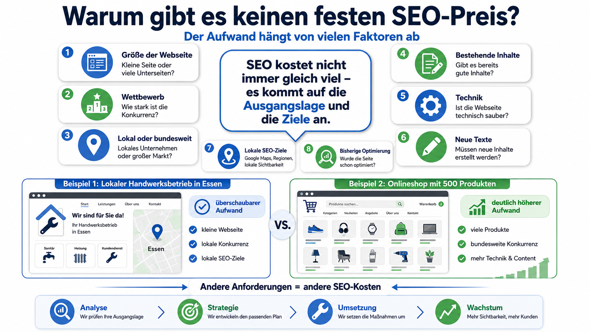
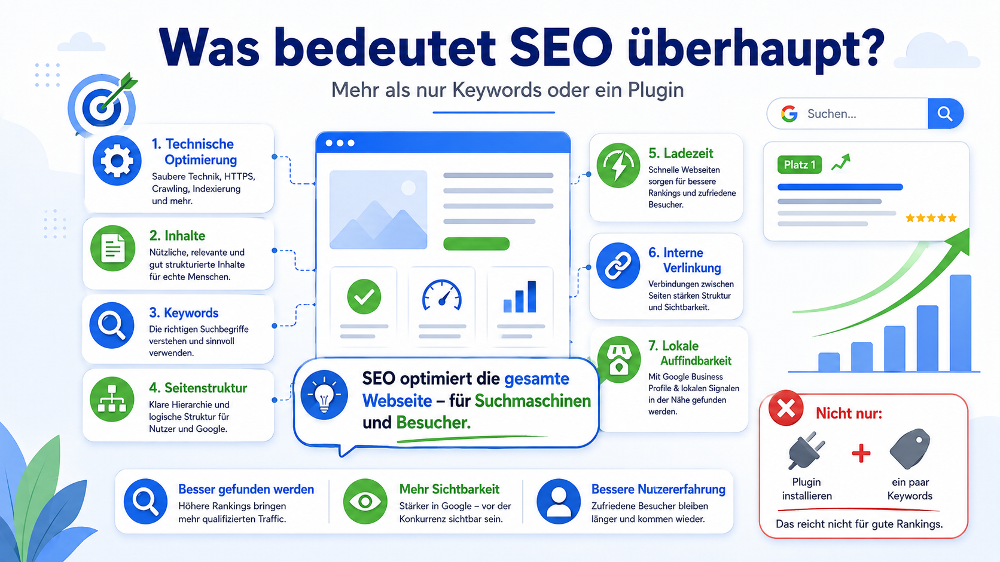
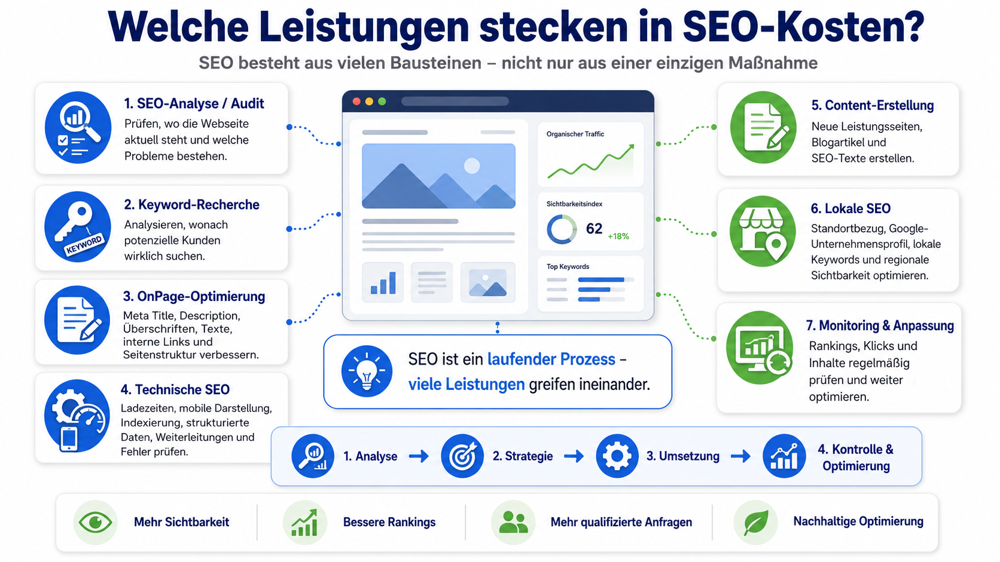
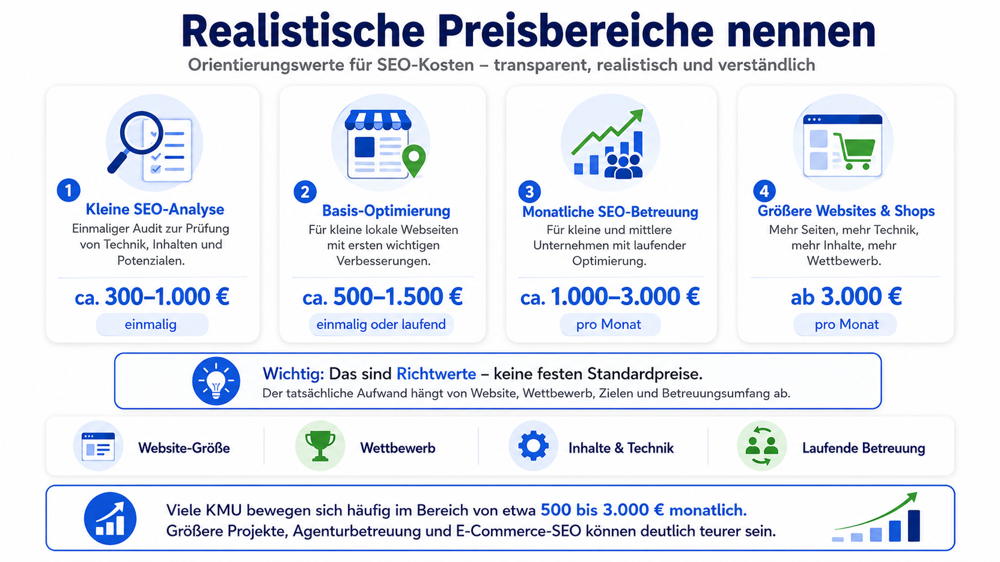
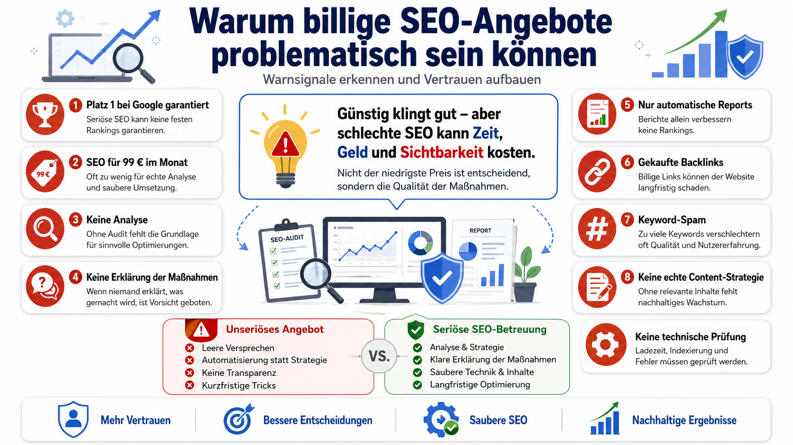
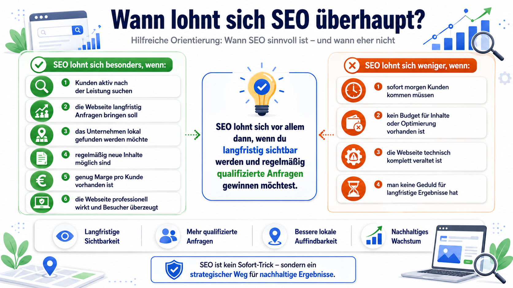
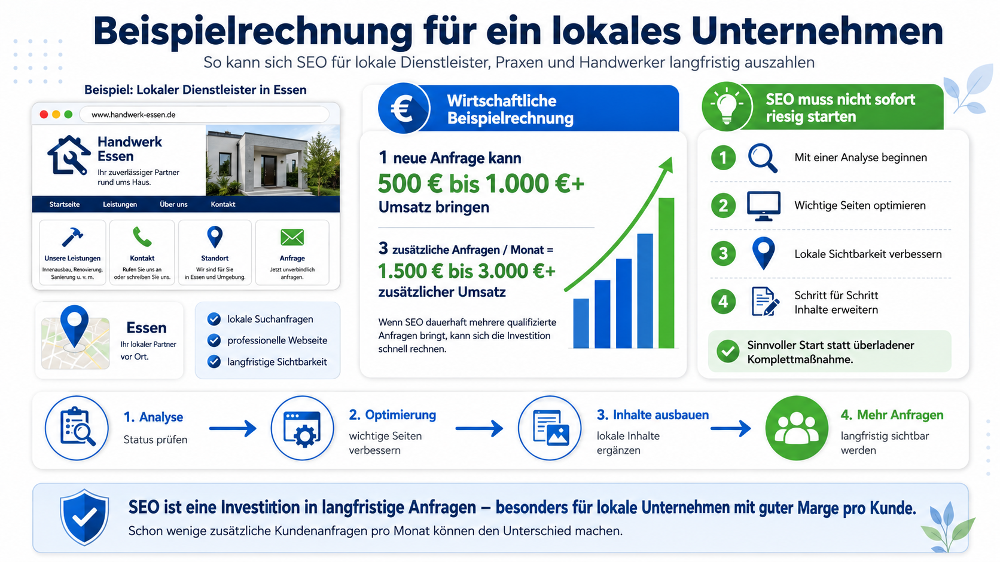
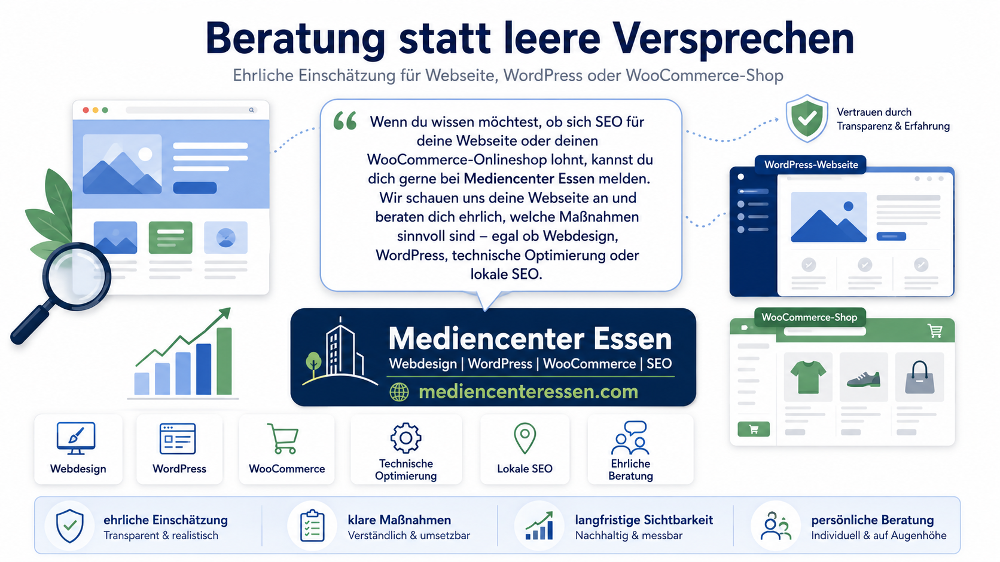

# Was kostet SEO? – Ehrliche Orientierung für Unternehmen

> **🧮 Direkt ausprobieren:** Der interaktive **SEO-Leistungs-Rechner** zeigt Ihnen in
> unter einer Minute, **welche SEO-Leistungen für Ihr Unternehmen relevant sind** und mit
> **welcher Preisspanne** Sie realistisch rechnen sollten.
>
> 👉 **[Rechner jetzt öffnen](https://tim-m-83.github.io/Was-kostet-SEO/)**

---

„Was kostet SEO?" ist eine der ersten Fragen, die Unternehmen stellen, sobald sie bei
Google sichtbarer werden möchten. Eine pauschale Antwort gibt es leider nicht – denn
Suchmaschinenoptimierung hat keinen festen Listenpreis.

Die Spanne ist groß: Eine einmalige Analyse kann schon für wenige hundert Euro zu haben
sein, eine professionelle, dauerhafte Betreuung dagegen mehrere tausend Euro pro Monat
kosten. Was am Ende sinnvoll ist, hängt von Ihrer Webseite, Ihrer Branche, Ihrem
Wettbewerb und Ihren Zielen ab.

Wichtig ist die richtige Perspektive: **SEO ist kein reiner Kostenpunkt, sondern eine
Investition** in dauerhafte Sichtbarkeit, Vertrauen und neue Kundenanfragen.

---

## Warum es keinen Pauschalpreis für SEO gibt

Der Wunsch nach einer klaren Zahl – „SEO kostet 500 € im Monat" – ist verständlich, in
der Praxis aber nicht haltbar. Jede Webseite startet von einem anderen Punkt, jede
Branche tickt anders und jedes Unternehmen verfolgt eigene Ziele.

Eine kleine Handwerker-Seite aus Essen hat ganz andere Voraussetzungen als ein
WooCommerce-Shop mit hunderten Produkten oder eine deutschlandweit ausgerichtete
Unternehmensseite. Diese Faktoren beeinflussen die Kosten besonders stark:

- Umfang und Größe der Webseite
- Qualität und Menge vorhandener Inhalte
- technischer Zustand (Ladezeit, Mobile, Indexierung)
- bestehende Rankings – oder Start bei null
- Stärke des Wettbewerbs
- gewünschte Reichweite (lokal, regional, deutschlandweit)
- ob ein Onlineshop optimiert werden soll
- einmalige Optimierung oder laufende Betreuung

Eine belastbare Einschätzung ist deshalb meist erst **nach einer Analyse der Webseite**
möglich.

---

## Was steckt eigentlich hinter SEO?

SEO (Suchmaschinenoptimierung) bedeutet, eine Webseite so zu verbessern, dass sie bei
Google besser gefunden wird – und zwar nicht nur über einzelne Keywords. Professionelle
SEO greift in mehreren Bereichen ineinander:

- **OnPage-SEO** – Inhalte, Überschriften, Meta-Angaben, interne Verlinkung, Struktur und Nutzerführung.
- **Technische SEO** – Ladezeiten, mobile Darstellung, Indexierung, Weiterleitungen, strukturierte Daten.
- **Content-SEO** – relevante Inhalte, die Suchanfragen beantworten und Vertrauen aufbauen.
- **Lokale SEO** – Sichtbarkeit in der eigenen Stadt oder Region, besonders für Dienstleister und Handwerk.
- **Shop-SEO** – zusätzlich Produkt- und Kategorieseiten, Filter, Ladezeiten und Conversion-Optimierung.

SEO ist also kein einzelner Handgriff, sondern ein Zusammenspiel aus Strategie, Technik,
Inhalten und kontinuierlicher Pflege.

---

## Die 7 Leistungen, die den Preis bestimmen

Damit die Kosten greifbarer werden, lohnt ein Blick auf die einzelnen Bausteine einer
SEO-Betreuung. Genau diese bewertet auch der [SEO-Leistungs-Rechner](https://tim-m-83.github.io/Was-kostet-SEO/).

1. **SEO-Analyse / Audit** – Bestandsaufnahme von Technik, Struktur und Inhalten, um gezielt dort anzusetzen, wo echtes Potenzial besteht.
2. **Keyword-Recherche** – Herausfinden, wonach Ihre Kunden wirklich suchen, inklusive der dahinterstehenden Absicht.
3. **OnPage-Optimierung** – Seitentitel, Meta-Beschreibungen, Überschriften, Texte, Alt-Texte, interne Links und URL-Struktur.
4. **Technische SEO** – Ladezeitoptimierung, mobile Darstellung, saubere Indexierung, Core Web Vitals, strukturierte Daten.
5. **Content-Erstellung** – Leistungsseiten, lokale Landingpages, Ratgeber, Blogartikel und FAQ-Bereiche.
6. **Lokale SEO** – Standortbezug, lokale Keywords, Google Unternehmensprofil, Bewertungen und einheitliche Unternehmensdaten.
7. **Laufende SEO-Betreuung** – Ranking-Monitoring, neue Inhalte, technische Überwachung und fortlaufende Optimierung.

---

## Realistische Preisbereiche im Überblick

Die folgenden Werte sind **grobe Richtwerte** und können je nach Projekt, Wettbewerb und
Leistungsumfang abweichen.

| Leistung | Richtwert |
|---|---|
| Einmalige SEO-Analyse | ca. **300 – 1.000 €** |
| Einmalige Basis-Optimierung | ca. **750 – 3.000 €** |
| Laufende Betreuung – kleine lokale Unternehmen | ca. **500 – 1.500 € / Monat** |
| Laufende Betreuung – kleine & mittlere Unternehmen | ca. **1.000 – 3.000 € / Monat** |
| Onlineshops & stark umkämpfte Märkte | ab **3.000 € / Monat** |

> Welche dieser Spannen auf Ihr Projekt zutrifft, berechnet der
> **[SEO-Leistungs-Rechner](https://tim-m-83.github.io/Was-kostet-SEO/)** anhand weniger Fragen.

---

## Vorsicht bei Billig-Angeboten („SEO für 99 € im Monat")

Sehr günstige SEO-Pakete klingen verlockend, sind aber meist problematisch: Für echte
Analyse, individuelle Strategie und manuelle Umsetzung bleibt kaum Zeit. Skeptisch werden
sollten Sie bei Versprechen wie:

- garantierter Platz 1 bei Google
- schnelle Rankings „ohne echte Arbeit"
- Pauschalpreise wie 99 € im Monat
- automatische Reports ohne tatsächliche Umsetzung
- Masse statt Klasse bei Backlinks
- identische Maßnahmen für alle Kunden
- keine vorherige Analyse der Webseite

Niemand kann Platz 1 für ein bestimmtes Keyword garantieren. Seriöse SEO verbessert die
Voraussetzungen – damit Google Ihre Seite besser versteht und Nutzer bessere Inhalte
finden.

---

## Wann sich SEO lohnt – und wann nicht

SEO lohnt sich besonders, wenn Ihre potenziellen Kunden aktiv nach Ihren Leistungen
suchen (z. B. „Webdesigner in Essen", „Physiotherapie Praxis Essen", „WooCommerce Shop
erstellen lassen").

**SEO ist sinnvoll, wenn Sie …**

- regelmäßig Kunden über Google gewinnen möchten
- langfristig sichtbar sein wollen
- eine professionell aufgebaute Webseite haben (oder verbessern möchten)
- eine ausreichende Marge pro Kunde haben
- auf lokale Suchanfragen angewiesen sind

Wenn Sie dagegen **sofort** neue Kunden brauchen, wirken Google Ads kurzfristig schneller.
Langfristig ist SEO oft nachhaltiger, weil gute Inhalte über lange Zeit Besucher bringen –
auch wenn keine Anzeigen mehr laufen.

---

## Einmalige Optimierung oder laufende Betreuung?

**Eine einmalige Optimierung** kann reichen, wenn die Webseite klein ist, grundlegende
Fehler behoben werden sollen, bereits gute Inhalte vorhanden sind oder das Budget begrenzt
ist.

**Eine laufende Betreuung** ist sinnvoll, wenn regelmäßig neue Inhalte entstehen sollen,
Wettbewerber aktiv SEO betreiben, mehrere Leistungen oder Standorte optimiert werden, ein
Onlineshop besser gefunden werden soll oder Rankings dauerhaft überwacht und verbessert
werden sollen.

Ein guter Einstieg ist häufig eine **SEO-Analyse mit anschließender Prioritätenliste**.
Danach lässt sich entscheiden, was sofort wichtig ist und was später folgen kann.

---

## Woran Sie eine seriöse SEO-Beratung erkennen

- Es wird zuerst analysiert, bevor Maßnahmen empfohlen werden.
- Die Strategie wird verständlich erklärt.
- Es werden keine „Platz-1-Garantien" gegeben.
- Maßnahmen sind individuell auf Ihre Webseite abgestimmt.
- Inhalte, Technik und Nutzerführung werden gemeinsam betrachtet.
- Es wird transparent kommuniziert, was umgesetzt wird.
- Die Webseite wird für echte Besucher optimiert – nicht nur für Google.

Gute Beratung ist ehrlich und sagt auch, wenn etwas Zeit braucht oder zuerst die
Grundlagen geschaffen werden müssen.

---

## Unterstützung von Mediencenter Essen

Sie möchten wissen, ob sich SEO für Ihre Webseite oder Ihren WooCommerce-Onlineshop lohnt?

**[Mediencenter Essen](https://mediencenteressen.com/)** unterstützt Unternehmen,
Selbstständige, Dienstleister, Praxen, Handwerksbetriebe und lokale Anbieter bei
professioneller Suchmaschinenoptimierung, WordPress-Webseiten, WooCommerce-Onlineshops,
Landingpages und technischer Webseitenpflege.

Wir analysieren Ihre Webseite, zeigen sinnvolle Optimierungsmöglichkeiten auf und beraten
ehrlich, verständlich und praxisnah – ob einmalige Analyse, technische Optimierung, lokale
SEO oder langfristige Betreuung.

👉 **Jetzt kostenlose Einschätzung anfragen: [https://mediencenteressen.com/](https://mediencenteressen.com/)**

*Mediencenter Essen – Webdesign, WordPress, WooCommerce & SEO*

---

## Häufige Fragen zum Thema SEO

**Was kostet SEO pro Monat?**
Das hängt stark vom Umfang ab. Kleine lokale Unternehmen starten oft bei etwa 500 – 1.500 €
pro Monat, kleine und mittlere Unternehmen eher bei 1.000 – 3.000 € oder mehr.

**Kann man SEO auch einmalig machen lassen?**
Ja. Eine einmalige Optimierung von Technik, Meta-Daten, Struktur und Basis-Inhalten ist
möglich und sinnvoll. Für dauerhafte Sichtbarkeit ist eine laufende Betreuung jedoch oft
die bessere Wahl.

**Warum ist SEO so unterschiedlich teuer?**
Weil Größe der Webseite, Wettbewerb, technischer Zustand, vorhandene Inhalte, Branche und
Ziele jeweils anders sind.

**Ist günstige SEO für 99 € im Monat sinnvoll?**
Selten. Für individuelle Analyse, Strategie, Technik und gute Inhalte bleibt dabei kaum
Zeit. Prüfen Sie genau, welche Leistungen wirklich enthalten sind.

**Was ist besser: SEO oder Google Ads?**
Google Ads wirken kurzfristig, SEO baut langfristige organische Sichtbarkeit auf. Oft ist
eine Kombination sinnvoll – abhängig von Ziel, Budget und Wettbewerb.

**Brauche ich SEO für meinen WooCommerce-Shop?**
In der Regel ja. Produktseiten, Kategorien, Ladezeiten, Produktbeschreibungen und die
technische Shop-Struktur beeinflussen stark, wie gut ein Shop gefunden wird.

**Kann Mediencenter Essen meine Webseite prüfen?**
Ja. [Mediencenter Essen](https://mediencenteressen.com/) unterstützt bei SEO-Analysen,
WordPress- und WooCommerce-Optimierung, lokaler SEO, technischen Verbesserungen und der
strategischen Weiterentwicklung Ihrer Webseite.

---

## Über dieses Projekt

Dieses Repository enthält einen kostenlosen, interaktiven **SEO-Leistungs-Rechner**
(reines HTML/CSS/JavaScript, ohne Tracking – alle Berechnungen laufen im Browser).

| Datei | Inhalt |
|---|---|
| `index.html` | Aufbau des Tools |
| `styles.css` | Gestaltung (responsive) |
| `app.js` | Fragebogen-Logik & Berechnung |
| `assets/` | Grafiken |

**Live-Version:** <https://tim-m-83.github.io/Was-kostet-SEO/>

Die angegebenen Preise sind unverbindliche Richtwerte und ersetzen keine individuelle
Analyse.

© Mediencenter Essen · <https://mediencenteressen.com/>
